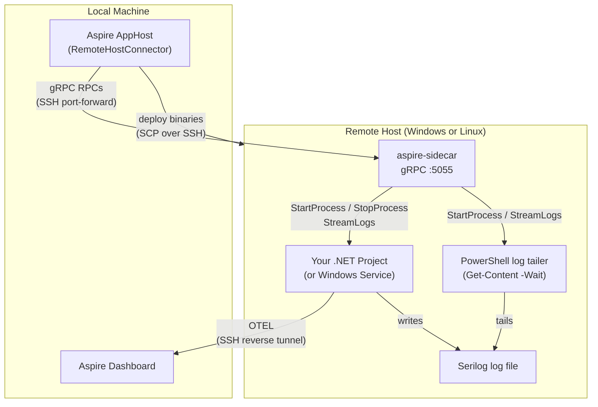

# Aspire.Hosting.RemoteDebugging

[](https://github.com/parithon/Aspire.Hosting.RemoteDebugging/actions/workflows/ci.yml)
[](https://github.com/parithon/Aspire.Hosting.RemoteDebugging/releases)
[](https://github.com/parithon/Aspire.Hosting.RemoteDebugging/pkgs/nuget/Aspire.Hosting.RemoteDebugging)

A .NET Aspire hosting extension that lets you deploy, run, and **remote-debug** .NET projects on a remote Windows or Linux host — all from your local Aspire AppHost. Logs, traces, and metrics flow back to the Aspire dashboard via an SSH-tunnelled OpenTelemetry pipeline.

---

## Features

- **Deploy & run** — builds and copies your .NET project binaries to the remote host over SSH, then launches them via a lightweight sidecar agent
- **Remote debugging** — installs `vsdbg` on the remote host automatically; attach from VS Code or Visual Studio
- **OpenTelemetry tunnel** — OTEL data (logs, traces, metrics) is reverse-tunnelled back to the local Aspire dashboard over the same SSH connection — no firewall rules needed
- **Windows Service support** — deploy and manage your project as a Windows Service via `AsWindowsService()`
- **Log streaming** — tail a Serilog log file on the remote host and stream each line to the Aspire console in real time via `WithLoggingSupport()`
- **Parameterised credentials** — SSH username and password can be stored as Aspire parameters (user secrets, environment variables)

---

## Installation

The package is published to **GitHub Packages**. Add the source once:

```bash
dotnet nuget add source https://nuget.pkg.github.com/parithon/index.json \
  --name github-parithon \
  --username YOUR_GITHUB_USERNAME \
  --password $(gh auth token) \
  --store-password-in-clear-text
```

Then add the package to your AppHost project:

```bash
dotnet add package Aspire.Hosting.RemoteDebugging
```

---

## Quick Start

### 1. Configure the remote host

```csharp
// AppHost/AppHost.cs
using System.Runtime.InteropServices;
using Aspire.Hosting.RemoteDebugging.RemoteHost.Transport;

var builder = DistributedApplication.CreateBuilder(args);

var password = builder.AddParameter("remote-password", secret: true);

var remoteHost = builder.AddRemoteHost("my-server", OSPlatform.Windows,
        new RemoteHostCredential("myuser", password))
    .WithEndpoint("192.168.1.100", TransportType.SSH, 22);
```

Store the secret locally:
```bash
dotnet user-secrets set "Parameters:remote-password" "your-password"
```

### 2. Add a remote project

```csharp
builder.AddRemoteProject<MyApp>("my-app", remoteHost);

builder.Build().Run();
```

### 3. Run and attach the debugger

Press **F5** in VS Code (with the C# Dev Kit extension) — the AppHost deploys the project, starts it on the remote host, and exposes the debugger port.

---

## Windows Service

Deploy and run your project as a Windows Service:

```csharp
builder.AddRemoteProject<MyWorker>("my-worker", remoteHost)
    .AsWindowsService("myworker", "My Worker Service")
    .WithLoggingSupport(
        @"C:\Windows\Logs\my-worker\app.log",
        "{Timestamp:yyyy-MM-dd HH:mm:ss.fff zzz} [{Level:u3}] {Message:lj}{NewLine}{Exception}")
    .WithEnvironment("service-mode", "windows");
```

`WithLoggingSupport` tails the Serilog log file on the remote host and streams each line to the Aspire console. Error and Fatal lines appear in **red** in the dashboard.

> Your app must use **Serilog** with a file sink and `RollingInterval.Infinite` so the log file path remains stable.

---

## API Reference

### `AddRemoteHost`

| Overload | Description |
|----------|-------------|
| `AddRemoteHost(name, platform, credential)` | Shorthand constructor |
| `AddRemoteHost(name, configure)` | Full options via `RemoteHostOptions` |

**Fluent modifiers:**

| Method | Description |
|--------|-------------|
| `.WithEndpoint(dns, type, port)` | Set hostname/IP, transport, and port |
| `.WithDeploymentPath(path)` | Override the remote deployment root |
| `.WithRemoteToolsPath(path)` | Override the path where vsdbg is installed |
| `.AsPlatform(platform)` | Override the OS platform |

### `AddRemoteProject<TProject>`

| Method | Description |
|--------|-------------|
| `.AsWindowsService(serviceName, displayName)` | Install and run as a Windows Service |
| `.WithLoggingSupport(logFilePath, outputTemplate?)` | Stream a Serilog log file to the Aspire console |
| `.WithEnvironment(key, value)` | Inject an environment variable into the remote process |

---

## Architecture



---

## Requirements

### Local machine

- [.NET 10 SDK](https://dotnet.microsoft.com/download)
- [.NET Aspire 13+](https://learn.microsoft.com/dotnet/aspire)
- Network access to the remote host on the SSH port (default: 22)

### Remote host

| Requirement | Windows | Linux |
|-------------|---------|-------|
| **OS** | Windows Server 2016+ or Windows 10/11 | Any modern distro |
| **SSH server** | [OpenSSH for Windows](https://learn.microsoft.com/windows-server/administration/openssh/openssh_install_firstuse) enabled and running | `sshd` running |
| **SSH port** | 22 (default, configurable) | 22 (default, configurable) |
| **.NET runtime** | .NET 10 runtime or SDK | .NET 10 runtime or SDK |
| **Deployment path** | Write access to `%USERPROFILE%\.aspire\deployments` (default) | Write access to `~/.aspire/deployments` (default) |
| **vsdbg path** | Write access to `%LOCALAPPDATA%\Microsoft\vsdbg` (default) | Write access to `~/.vsdbg` (default) |
| **Firewall** | No inbound rules needed — all traffic flows over the SSH tunnel | No inbound rules needed |

#### Additional requirements for `AsWindowsService`

| Requirement | Notes |
|-------------|-------|
| **Elevated SSH user** | The SSH user must be a member of the local **Administrators** group to run `sc.exe create/start/stop/delete` |
| **PowerShell** | PowerShell must be available (`powershell.exe`) — needed for environment variable injection scripts |
| **`WithLoggingSupport`** | App must use **Serilog** with a **file sink** and `RollingInterval.Infinite`; the log directory must be writable by the service account (default: `LocalSystem`) |

---

## License

[MIT](LICENSE)
