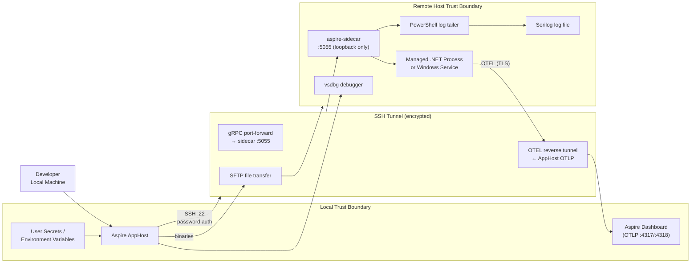

# Threat Model — Aspire.Hosting.RemoteDebugging

**Scope:** Development-time use only. This tool is designed to be used on trusted development networks. It is **not** intended for production deployments or exposure to untrusted networks.

---

## System Overview



---

## Assets and Data Flows

| Asset | Sensitivity | Where it lives |
|-------|-------------|----------------|
| SSH password | High | Aspire user secrets / env var — never in source code |
| Remote host binaries | Medium | Uploaded via SFTP over SSH tunnel; stored in deployment path |
| Application environment variables | Medium | Injected via PowerShell registry script on remote host |
| vsdbg debugger | Medium | Installed on remote host; downloaded from `https://aka.ms/getvsdbgsh` |
| OTEL telemetry (logs, traces, metrics) | Low–Medium | Tunnelled back over SSH; viewed in local Aspire dashboard only |
| Serilog log file contents | Low–Medium | Written by app on remote host; tailed and streamed to local dashboard |
| gRPC sidecar channel | Low | Bound to `127.0.0.1` on remote; exposed locally over SSH port-forward |

---

## Trust Boundaries

| Boundary | Crossing mechanism | Protection |
|----------|--------------------|------------|
| Local machine → Remote host | SSH (port 22) | SSH encryption; password authentication |
| AppHost → Sidecar (gRPC) | SSH port-forward over same connection | SSH tunnel — no additional TLS on gRPC channel |
| Remote app → AppHost (OTEL) | SSH reverse tunnel | SSH tunnel + TLS on OTEL endpoint |
| Developer → Aspire dashboard | Local loopback | No external exposure |

---

## STRIDE Threat Analysis

### T1 — SSH Host Key Not Verified (Spoofing)

| | |
|-|-|
| **Category** | Spoofing |
| **Severity** | High |
| **Status** | ✅ Mitigated |

**Description:**  
`SshTransport.ConnectAsync` subscribes to `HostKeyReceived` and validates the received fingerprint against the value stored via `WithHostKeyFingerprint()`. If the fingerprints do not match, `e.CanTrust = false` is set and the connection is rejected. If no fingerprint is configured, a `Warning`-level log is emitted on every connection attempt that includes the received fingerprint to make first-time configuration easy.

**Mitigations (current):**
- `WithHostKeyFingerprint(sha256)` pins the expected fingerprint on the `RemoteHostResource`.
- Mismatch → connection rejected with an `Error`-level log.
- Not configured → `Warning` log with the received fingerprint so developers can copy-paste it into their AppHost.

**Operator guidance:**  
Obtain your host's fingerprint once and add it to the AppHost:
```bash
ssh-keyscan -t ed25519 <host> | ssh-keygen -lf -
```
```csharp
builder.AddRemoteHost("my-server", OSPlatform.Windows, credential)
    .WithEndpoint("192.168.1.100", TransportType.SSH, 22)
    .WithHostKeyFingerprint("abc123...your-fingerprint-here");
```

---

### T2 — SSH Password Credential in Memory (Information Disclosure)

| | |
|-|-|
| **Category** | Information Disclosure |
| **Severity** | Medium |
| **Status** | ✅ Mitigated |

**Description:**  
The SSH password is resolved from an Aspire `ParameterResource` (user secrets or environment variable) and held in a `string` in memory during the SSH handshake. Strings in .NET are immutable and GC-managed, meaning the value may persist in memory until the next GC cycle.

**Mitigations (current):**
- Password is never written to source code; it must be stored as a user secret or environment variable.
- Password is never written to any log at any log level.
- Aspire's `ParameterResource` masks the value in the dashboard UI.

**Residual risk:** Memory forensics on the local machine could recover the value. Acceptable for a development-time tool.

---

### T3 — Sidecar gRPC Has No Authentication (Elevation of Privilege)

| | |
|-|-|
| **Category** | Elevation of Privilege |
| **Severity** | Medium |
| **Status** | ✅ Mitigated by architecture |

**Description:**  
The sidecar gRPC service (`aspire-sidecar`) listens on TCP port 5055 with no TLS and no authentication token. Any process that can reach that port can start/stop arbitrary processes on the remote host.

**Mitigations (current):**
- The sidecar binds to all interfaces (`:5055`) but the AppHost only connects via an SSH port-forward to `127.0.0.1`. The SSH connection is required to reach the sidecar.
- On a correctly configured remote host, port 5055 is not exposed through the firewall.

**Residual risk:** If the remote host's firewall exposes port 5055 to the network, any unauthenticated client can control the sidecar. Operators must verify firewall rules.

**Recommended improvement:** Add a shared secret / bearer token to sidecar RPCs, or bind the sidecar to `127.0.0.1` only.

---

### T4 — PowerShell Script Execution with `-ExecutionPolicy Bypass` (Tampering)

| | |
|-|-|
| **Category** | Tampering |
| **Severity** | Medium |
| **Status** | ✅ Mitigated |

**Description:**  
`WindowsServiceRunner` uploads `.ps1` scripts to the remote deployment path via SFTP and executes them with `powershell.exe -NonInteractive -ExecutionPolicy Bypass -File`. If an attacker could tamper with the file on disk between upload and execution, arbitrary code could run under the SSH user's account.

**Mitigations (current):**
- Scripts are uploaded via SFTP over the encrypted SSH tunnel immediately before execution — the time-of-check to time-of-use window is minimal.
- The deployment path is under the SSH user's home directory and requires authenticated write access.

**Residual risk:** If the remote host is already compromised, an attacker with write access to the deployment path could substitute scripts.

---

### T5 — vsdbg Downloaded from External URL (Supply Chain)

| | |
|-|-|
| **Category** | Tampering / Supply Chain |
| **Severity** | Medium |
| **Status** | ✅ Mitigated |

**Description:**  
`SshTransport.InstallRemoteDebugger` downloads `vsdbg` from Microsoft's CDN. Previously hardcoded to `"latest"`, the version is now configurable via `WithVsdbgVersion()`. A `Warning`-level log is emitted when `"latest"` is used to prompt developers to pin a specific version.

**Mitigations (current):**
- `WithVsdbgVersion("x.y.z")` pins vsdbg to a specific, reproducible build.
- When `"latest"` is used (the default), a warning is logged on every install.
- The URL is a Microsoft-owned short-link (`aka.ms`) served over HTTPS.

**Operator guidance:**  
Pin the vsdbg version in your AppHost for reproducible, supply-chain-safe installs:
```csharp
builder.AddRemoteHost("my-server", OSPlatform.Windows, credential)
    .WithVsdbgVersion("17.13.30618.01");
```

**Residual risk:** The vsdbg installer script itself is still fetched dynamically over HTTPS without a checksum. This is an inherent limitation of Microsoft's vsdbg distribution mechanism.

---

### T6 — Log File Contents Streamed to Dashboard (Information Disclosure)

| | |
|-|-|
| **Category** | Information Disclosure |
| **Severity** | Low–Medium |
| **Status** | ✅ By design — operator awareness required |

**Description:**  
`WithLoggingSupport` tails the configured Serilog log file and streams every line to the local Aspire dashboard. If the app logs sensitive data (PII, credentials, health records), that data will appear in the developer's local dashboard and in any structured log exporters attached to it.

**Mitigations (current):**
- Streaming is opt-in via `WithLoggingSupport()`.
- The data only flows to the local Aspire dashboard — it is not sent to any external service by this library.

**Operator guidance:** Configure Serilog to redact sensitive fields (e.g., `Destructure.ByTransforming`) before enabling log streaming.

---

### T7 — Sidecar Inactivity Timeout Can Cause Denial of Service (Denial of Service)

| | |
|-|-|
| **Category** | Denial of Service |
| **Severity** | Low |
| **Status** | ✅ Mitigated |

**Description:**  
The sidecar `ConnectionMonitor` shuts down all managed processes after 5 minutes of gRPC inactivity. If the AppHost's Ping RPCs are delayed (e.g., network hiccup), the remote processes are killed unexpectedly.

**Mitigations (current):**
- Active `StreamLogs` calls reset the inactivity timer, so streaming resources are not affected.
- The AppHost reconnects and restarts processes automatically on SSH reconnection.

---

### T8 — Environment Variables Written to Windows Registry (Information Disclosure)

| | |
|-|-|
| **Category** | Information Disclosure |
| **Severity** | Low |
| **Status** | ✅ By design — operator awareness required |

**Description:**  
`WindowsServiceRunner` injects environment variables (including `Logging__FilePath`, `Logging__OutputTemplate`, and any `WithEnvironment` values) into the Windows Service registry key at `HKLM\SYSTEM\CurrentControlSet\Services\<ServiceName>\Environment`. These values persist on the remote host after `aspire stop` and are readable by local administrators.

**Mitigations (current):**
- No secrets or credentials are injected via `WithEnvironment` by this library.
- Registry values are removed when the service is deleted via `sc.exe delete` on `aspire stop`.

**Operator guidance:** Do not pass secrets via `WithEnvironment`; use a secrets manager or environment-specific configuration files instead.

---

## Out of Scope

- **Production deployments** — this tool is not designed for, and should not be used in, production environments.
- **Multi-user access to the Aspire dashboard** — the dashboard is a local development tool; access control is out of scope.
- **Remote host OS hardening** — the security of the remote host itself (patching, antivirus, firewall rules beyond port 5055) is the operator's responsibility.
- **Key management for OTEL TLS** — the TLS certificate used for OTEL is managed by the .NET Aspire host; its lifecycle is outside this library.

---

## Recommended Improvements (Priority Order)

| # | Threat | Action | Status |
|---|--------|--------|--------|
| 1 | T1 — Host key spoofing | `WithHostKeyFingerprint()` added; warn when not configured | ✅ Done |
| 2 | T3 — Unauthenticated sidecar | Bind sidecar to `127.0.0.1` only, or add a per-session bearer token to gRPC RPCs | ⚠️ Open |
| 3 | T5 — vsdbg supply chain | `WithVsdbgVersion()` added; warn when using `"latest"` | ✅ Done |

---

*This document should be reviewed whenever the SSH transport, sidecar protocol, credential handling, or deployment pipeline changes.*
